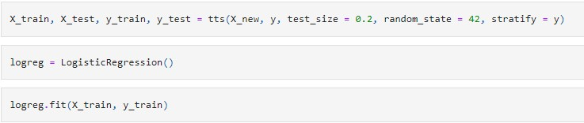
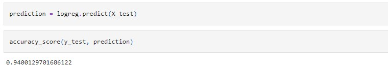
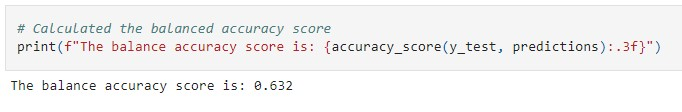
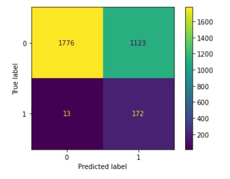

# Vehicle_Insurance_Fraud_Detection_Final_Project

Contributors:

- Christine Gendron
- Mitchel Diaz
- Steven Dookhantie

## Purpose

Vehicle Insurance Fraud occurs when someone attempts to deceive an insurance company while making a claim, in order to get a larger payout.

This could mean anything from misrepresenting a detail to faking an accident. It is an expensive, increasingly common, and avoidable problem for insurers.

Fraud is not exclusive to auto insurers. The entire financial services industry is experiencing rapidly rising levels of fraud, coming in many different forms. Insurers aren’t the only ones affected- fraudulent account activity can have devastating effects on consumers.

That’s why using machine learning to replace time-intensive manual review with automated fraud detection processes will

## Questions to Answer

- Can we accurately predict whether an insurance claim is fraudulent?
- Which features are correlated with higher likelihood of fraud?

### Our Data

Our dataset was generated by Angoss KnowledgeSEEKER, a provider of systems for predictive analytics, and found on Kaggle.

This set features over 15,000 claim samples with 33 columns, including information on:

- Demographics of claimant
- Details on the vehicle in question
- Information about the claimants’ policies.
- Whether fraud was detected

[Link to Data](https://www.kaggle.com/datasets/khusheekapoor/vehicle-insurance-fraud-detection)

## Prepping for the Machine Learning Model

- We summarized the dataset using describe(), and identified the column data types using the dtypes attribute.

- We handled missing values using two functions: One to find them, and one using KNNImputer to impute them.

#### Feature Selection and Train_Test_Split

- Some unnecessary columns were dropped after exploratory analysis, including Week of Month, Deductible, AddressChange-Claim, and RepNumber.

- Using a For Loop, we dropped numerical features with a correlation of above 0.8, since those features would make the algorithm more complex without adding significant information.

- The FraudFound column is being used as our target variable, since this is the value we're attempting to predict.

- Data was split into training and testing sets by importing the train_test_split function from sklearn.model_selection, and passing in our target (FraudFound), our features, and a random_state value of 42. These sets are being given the variable names: X_train, X_test, y_train, and y_test.

## Our Machine Learning Models

### Logistic Regression

First, we used Logistic Regression to predict fraud. Logistic Regression is not the best algorithm for identifying complex relationships, but our dependent variable (FraudFound) is binary- either fraud was found, or it was not. Logistic Regression an efficient algorithm for predicting this type of outcome.

Using Scikit-learn, we created a LogisticRegression() object, then used fit() to train the model using the X_train and y_train sets. Then, we used predict() to return predicted values for FraudFound in our training set (X_test). Using those predicted values and our y_test set, we generated an accuracy score using accuracy_score(). As shown below, our accuracy score is 0.94.

### Random Forest

We also used Scikit-learn to initialize a Random Forest Classifier model using BalancedRandomForestClassifier to complete the above steps for fitting, training, and predicting, using 100 estimators. This model yielded a lower balanced accuracy score of 0.632:

Based on the below confusion matrix, the lower score is related to a high number of false positives. 1,123 legitimate claims were incorrectly flagged as fraud, compared to only 13 missed fraudulent claims.

## Presentation

Click the link below to view our presentation on this topic.

[Google Slides](https://docs.google.com/presentation/d/1seDY3_Q9IZwSew6P-d4DhcwpT5R2ONvDfI21CGmWDHc/edit#slide=id.g14d5c27d989_3_0)

test
